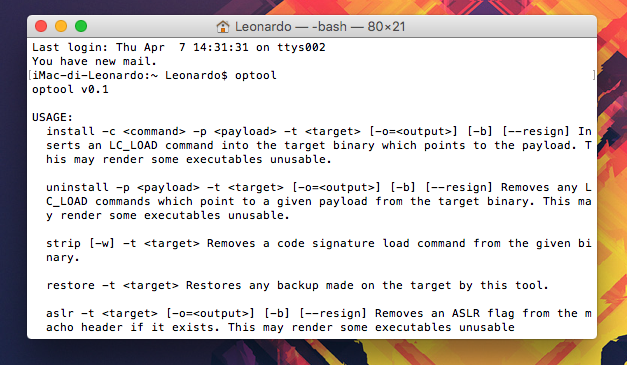
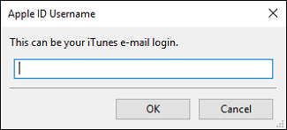

# Extensify IPAs

## Download Links

### Cercube 3 for YouTube

* [YouTube v12.16.7 + Cercube 3 v1.7.1](http://ideviceteam.com/ipa_signed/YouTube_v12.16.7_Cercube3_v1.7.1.ipa)

### Cercube 4 for YouTube

* [YouTube v12.16.7 + Cercube 4 v4.0.9.6](http://ideviceteam.com/ipa_signed/YouTube_v2.16.7_Cercube4_v4.0.9.6.ipa)

### Mercury for Twitch

*  [Twitch v3.20.1 + Mercury v1.0.1](http://ideviceteam.com/ipa_signed/Twitch_v3.18_Mercury_v1.0.1.ipa)

### Prenesi 3 for Facebook

* [Facebook v91.0 + Prenesi 3 v3.0.9](Facebook_v91.0_Prenesi_v3.0.9.ipa)

### Rocket for Instagram

* [Instagram v10.19.0 + Rocket v1.4.8](http://ideviceteam.com/ipa_signed/Instagram_v10.19.0_Rocket_v1.4.8.ipa)

### SaveCloud for SoundCloud

* [SoundCloud v5.4.0 + SaveCloud v1.0.9](http://ideviceteam.com/ipa_signed/SoundCloud_v5.4.0_SaveCloud_v1.0.9.ipa)

### Watusi 2 for WhatsApp

* [WhatsApp v2.17.22 + Watusi 2 v0.12.1](http://ideviceteam.com/ipa_signed/WhatsApp_v2.17.22_Watusi2_v0.12.1.ipa)

## Exos descriptions

* Cercube 3 for YouTube
* Cercube 4 for YouTube
* Mercury for Twitch
* Prenesi 3 for Facebook
* Rocket for Instagram
* SaveCloud for SoundCloud
* Watusi 2 for WhatsApp

## How to manually create IPAs with exos

### Requirements:

1. A computer running macOS;
2. [Xcode](https://itunes.apple.com/it/app/xcode/id497799835?mt=12) installed;
3. [iTunes (latest version)](https://api.ipsw.me/v2.1/iTunes/osx/latest/url/dl);
4. [optool](https://github.com/alexzielenski/optool) (to install it, follow the guide);
5. [Cydia Impactor](http://www.cydiaimpactor.com);
6. Extensify Exo you need (available [here](https://github.com/Sn0wCooder/Extensify-Exos));
7. An iOS device connected to the computer.

### Guide:

#### 1. Install _optool_ binary (only for the first time)

To install _optool_ (only for the first time), open Terminal (/Applications/Utilities/Terminal) and digit this command: ```cd /usr/bin && sudo curl -OL https://github.com/alexzielenski/optool/releases/download/0.1/optool.zip && sudo unzip /usr/bin/optool.zip -d /usr/bin && sudo rm -rf optool.zip```.

At the beginning, Terminal will ask you Administrator’s password. Enter it and continue (while you write it you will not see anything, but you’ll be writing correctly!).

To check if _optool_ is installed correctly, digit optool on Terminal, and it will show you this:



### 2. Download/create cracked/decrypted version of the app you want to sideload

If you want to create decrypted IPAs, you can use some tools for your Jailbroken device, such as _clutch_ or _Rasticrac_.

If you want to download cracked IPAs, Google is your friend :D

### 3. Unpack IPA

Right click on IPA file previously, choose Open With and select Archive Utility.


### 4. Injecting dylib(s)

Open Terminal and digit the following codes:

```optool install -c load -p @executable_path/[NameOfDylib].dylib -t [APPEXEC]```

```[NameOfDylib]``` is the name of the dylib we are injecting in the app, while ```[APPEXEC]``` is the executable of the IPA (in the Payload folder of the decrypted app).

For example: ```optool install -c load -p @executable_path/Cercube.dylib -t /Users/Leonardo/Desktop/YouTube/Payload/YouTube.app/YouTube```.

The output should be similar to this one:


### 5. Copy files in the main directory of the application

Now you have to copy the dylib(s) (and eventually the _.bundle_) in the main directory of the _.app_.

### 6. Compress Payload folder

Then you have to compress the Payload folder to a ZIP file.


### 7. Sign the IPA with Cydia Impactor

To do it, follow the following guide.

## How to Sideload on non-Jailbroken devices

### Requirements:

1. A computer running macOS, Windows or Linux;
2. Internet connection;
3. Apple ID (email & password).

#### Guide:

* Download the IPA file from the link above or create it;
* Download Cydia Impactor for the OS of your choice from [here](http://www.cydiaimpactor.com) and run it;
* Remove any instances of the original apps that are currently installed on your iOS device;
* Connect your iOS device and hit "Trust" if prompted. Your device will appear in Cydia Impactor now;
* Drag the IPA file from your Desktop to Cydia Impactor;


* Enter your Apple ID email address when prompted;



* Enter Your Apple ID password when prompted;


* If you get an alert like the following, press "OK";


* Wait for Cydia Impactor to finish then open the app on your iOS device.

**Don't forget you have to do to repeat this every week!**

## Credits

* Kabir Oberai for [exopatcher](http://github.com/kabiroberai/exopatcher);
* Alex Zielenski for [optool](https://github.com/alexzielenski/optool).

Want to sideload UnlimApps ++ IPAs? Go [here](https://github.com/JMccormick264/PPAppsIPARepo)!